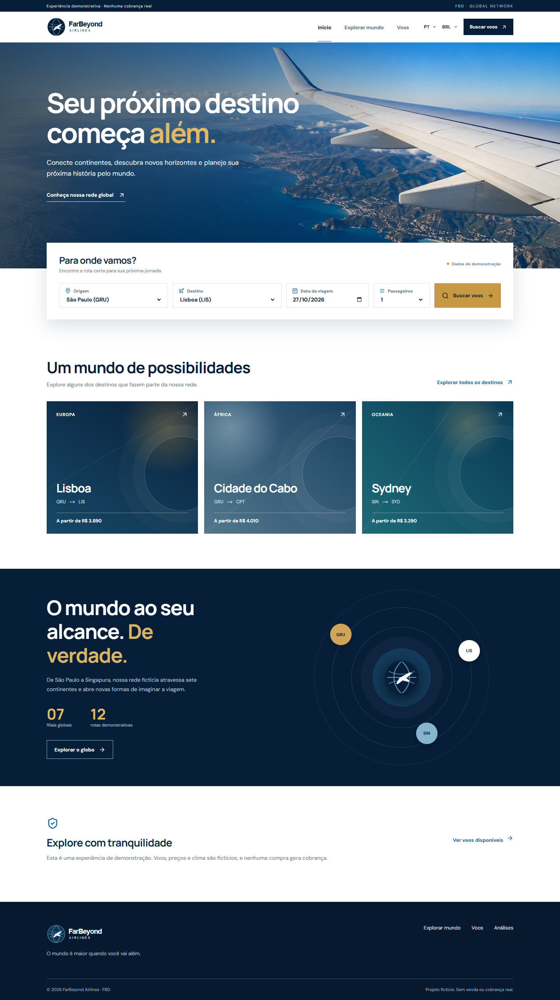
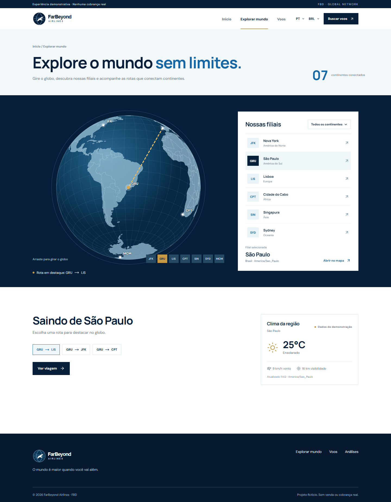
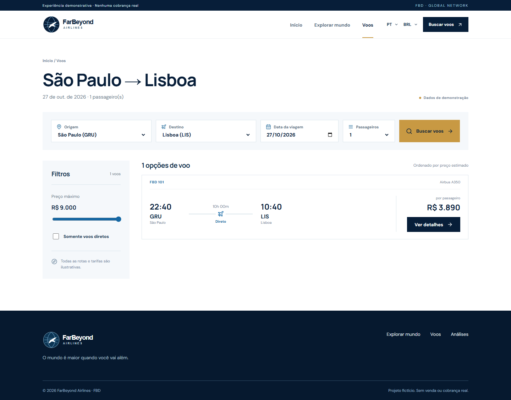
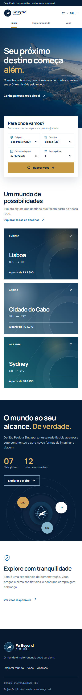

# FarBeyond Airlines

Experiência web responsiva para uma companhia aérea fictícia. Pesquise rotas globais, explore sete filiais em um globo interativo e percorra uma reserva completa de demonstração. Nenhuma passagem é emitida e nenhuma cobrança é realizada.

## Visão rápida

| Área        | O que oferece                                                                     |
| ----------- | --------------------------------------------------------------------------------- |
| `/`         | Apresentação da FBD, busca e destinos em destaque                                 |
| `/explore`  | Globo arrastável, sete filiais, doze rotas, clima sintético e localização externa |
| `/flights`  | Resultados por origem/destino/data, preço máximo e filtro de voo direto           |
| `/trip/:id` | Itinerário, globo, clima e três gráficos ilustrativos                             |
| `/checkout` | Passageiros, opcionais, cartão visual e confirmação fictícia                      |
| `/insights` | Gráficos públicos e tarifa média da rede fictícia                                 |

## Prints reais

| Landing desktop                                                     | Exploração global                                                   |
| ------------------------------------------------------------------- | ------------------------------------------------------------------- |
|  |  |

| Resultados desktop                                                    | Landing em 390 px                                                 |
| --------------------------------------------------------------------- | ----------------------------------------------------------------- |
|  |  |

## Stack

Monorepo npm workspaces com React 19, Vite 7, TypeScript estrito, React Router, D3 Geo, Express 5, ESLint e Prettier. O globo usa projeção ortográfica com o atlas mundial; a fotografia da landing foi gerada para este projeto. Os logos são SVG.

## Instalar e executar

Requer Node.js 24 e npm 11.

```bash
npm ci
npm run dev
```

Abra `http://127.0.0.1:5173`. A API local responde em `http://127.0.0.1:3001`. Nenhuma chave de API é necessária. A variável `PORT` é opcional para a API (padrão `3001`); se alterada, ajuste o proxy em `apps/web/vite.config.ts`.

```bash
npm run lint
npm run format:check
npm run typecheck
npm run build
```

Com `npm run dev` em execução e Chrome instalado, `npm run test:smoke` percorre a busca, checkout, globo, API, idiomas, moedas e largura de 390 px.

## Estrutura

```text
apps/
  api/                 API Express e MockWeatherProvider
  web/                 React, páginas, globo, assets e prints
packages/
  shared/              tipos, filiais, rotas e cálculo de cotação
  config/              ESLint, Prettier e TypeScript
docs/                   arquitetura e modelo de dados
.github/                CI e templates
```

## Limites dos dados

Existem exatamente sete filiais e doze rotas direcionais. Valores e horários são estimativas fictícias; clima, comparação de aeroportos e série de preços são sintéticos. BRL/USD usa câmbio fixo de demonstração. Não há login, persistência de reservas, pagamento real ou integração climática externa. O formulário de checkout mantém os dados pessoais apenas no estado da página; a API recebe só opções de cotação.

## Próximas etapas possíveis

Integrar uma fonte climática real pelo contrato `WeatherProvider`, ampliar a malha de voos, introduzir busca com conexões e incorporar testes de usabilidade com viajantes. Qualquer passo rumo a venda real exigirá um projeto separado de pagamentos, proteção de dados e emissão de bilhetes.

Veja [arquitetura](docs/architecture.md), [modelo de dados](docs/data-model.md) e [guia de contribuição](CONTRIBUTING.md).
